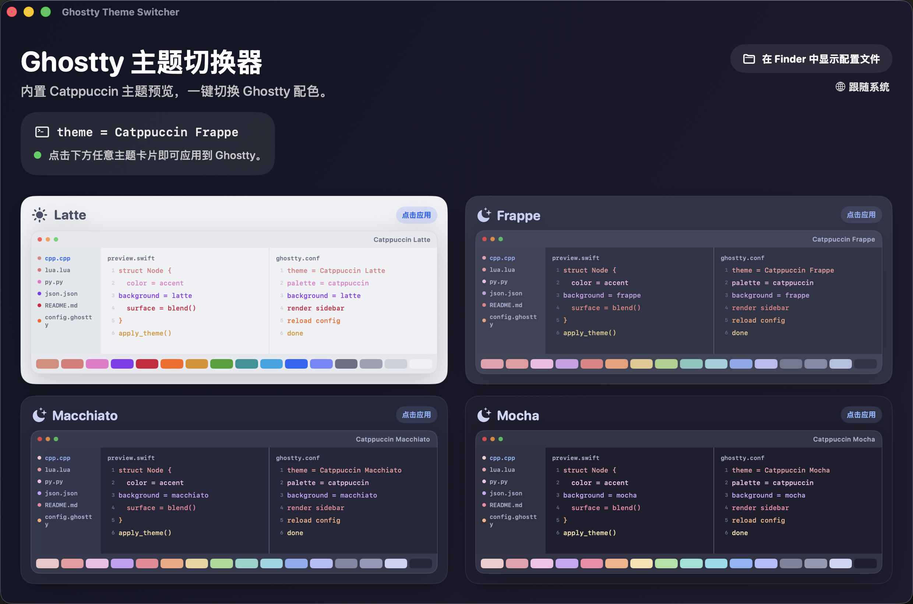

# Ghostty 主题切换器

> 一个小巧的原生 macOS 应用，一键在 [Ghostty](https://ghostty.org/) 中切换 [Catppuccin](https://catppuccin.com/) 主题。

简体中文 · [English](README.md)


## 截图



## 特性

- 内置 512 款 Ghostty 兼容主题，支持搜索和真实调色板预览。
- 支持单主题应用，也支持用 Ghostty 原生 `theme = light:...,dark:...` 语法配对浅色/深色主题，跟随 macOS 外观切换。
- 点一下就改写 `config.ghostty`，并通过 AppleScript 自动让 Ghostty 重载配置。
- 内置主题会在首次应用时按需安装到 Ghostty 的应用支持目录，再写入配置。
- 每次写入前都会留一份 `config.ghostty.bak` 备份，避免误操作。
- 双语界面（English / 简体中文）：默认跟随 macOS 系统语言，也可在 App 内通过 🌐 菜单手动切换。
- 同一个可执行文件还自带命令行模式，方便脚本和 Shortcuts 调用。

## 系统要求

- macOS 13（Ventura）或更新版本
- 使用 Apple Silicon 芯片的 Mac
- 已安装 [Ghostty](https://ghostty.org/) 并放在 `/Applications` 目录

## 安装

### 方式一 —— 下载发行版

1. 在 [Releases](../../releases) 页面下载最新的 Apple Silicon 发行版。
2. 下载 `.dmg` 或 `.zip` 都可以。你**不需要**安装 Xcode、Swift 或任何开发环境。
3. 把 **Ghostty Theme Switcher.app** 移动到 `/Applications` 文件夹里。
   - 如果下载的是 `.dmg`，在挂载后的窗口里把 App 拖到 `Applications` 快捷方式上。
   - 如果下载的是 `.zip`，先解压，再把 App 拖到 `/Applications`。
3. **首次打开**：因为本 App 没有花钱购买 Apple 开发者账号做签名，macOS 第一次会拦截它。**别双击**，按下面的步骤来：
   - 在「访达」里打开 `/Applications` 文件夹
   - 找到 **Ghostty Theme Switcher**，**右键**点击它（触控板用户可以按住 `Control` 键再点一下）
   - 在弹出的菜单里选「**打开**」
   - 系统再弹一次确认对话框，点「**打开**」即可
   - 之后每次双击都能正常启动。

> **如果 macOS 提示「App 已损坏，无法打开」**：这是因为浏览器下载的文件被系统打上了"隔离"标记，并不是 App 真的坏了。打开「终端」运行下面这行命令即可解决：
> ```sh
> xattr -dr com.apple.quarantine "/Applications/Ghostty Theme Switcher.app"
> ```
> 然后再尝试打开 App。

> **架构说明：** 当前发行版仅支持 **Apple Silicon**（`arm64`）且系统需为 macOS 13 或以上。

### 方式二 —— 自己编译

```sh
git clone https://github.com/haixing23/GhosttyThemeSwitcher.git
cd GhosttyThemeSwitcher
zsh tools/build_app.sh
open dist/Ghostty\ Theme\ Switcher.app
```

打包好的 App 会出现在 `dist/` 目录里。

如果想一步生成发布用的 `.app`、`.zip` 和 `.dmg`，执行：

```sh
zsh tools/build_release.sh
```

脚本会先跑测试，再输出带版本号的产物，例如：

```text
dist/GhosttyThemeSwitcher-v1.0.1-macos-arm64.zip
dist/GhosttyThemeSwitcher-v1.0.1-macos-arm64.dmg
```

## 使用方法

1. 打开 App。
2. 用搜索框筛选主题。
3. 在「单主题」模式下，点击任意主题卡片即可应用。
4. 在「跟随系统」模式下，分别选择浅色主题和深色主题，再点击「应用配对」。之后 Ghostty 会通过原生 light/dark 主题语法跟随 macOS 外观切换。

### 权限说明

第一次让 App 重载 Ghostty 时，macOS 会弹出 **自动化** 权限请求。如果不小心点了拒绝，可以到下面这里重新打开：

> 系统设置 → 隐私与安全性 → 自动化 → Ghostty Theme Switcher → Ghostty

如果你是从下载的发行版安装，建议在第一次通过右键成功打开 App 后，再按系统提示授予这个权限。即使暂时不给，主题切换仍可写入配置，只是无法自动让 Ghostty 立刻重载。

### 命令行模式

同一个可执行文件也可以当 CLI 用，方便写 shell 脚本、Raycast 或快捷指令调用：

```sh
"/Applications/Ghostty Theme Switcher.app/Contents/MacOS/Ghostty Theme Switcher" --apply mocha
"/Applications/Ghostty Theme Switcher.app/Contents/MacOS/Ghostty Theme Switcher" --apply-system catppuccin-latte catppuccin-mocha
"/Applications/Ghostty Theme Switcher.app/Contents/MacOS/Ghostty Theme Switcher" --list
```

`--list` 会输出制表符分隔的主题 `id`、标题、来源和深浅色分类。

## 工作原理

App 会读取 `~/Library/Application Support/com.mitchellh.ghostty/config.ghostty`，替换（或追加）其中的 `theme = …` 行，然后用 AppleScript 通知正在运行的 Ghostty 重载配置。修改前的版本始终会保存为同目录下的 `config.ghostty.bak`。内置主题首次应用时会复制到 `~/Library/Application Support/com.mitchellh.ghostty/themes/ghostty-theme-switcher/`。

## 项目结构

```
GhosttyThemeSwitcher/
├── Sources/
│   └── GhosttyThemeSwitcher/         # SwiftUI 界面 + CLI 入口
│       └── Resources/
│           ├── bundled-themes.json   # 生成的主题元数据
│           ├── themes.json           # 兼容用主题元数据副本
│           └── BundledThemes/        # 生成的 Ghostty 主题文件
├── Tests/
│   └── GhosttyThemeSwitcherTests/
├── tools/
│   ├── build_app.sh                  # 把 .app 打包到 dist/
│   ├── generate_theme_catalog.py     # 重新生成内置 Ghostty 主题
│   ├── build_icon.sh
│   ├── Info.plist
│   ├── AppIcon.icns
│   ├── AppIcon.png
│   └── AppIcon.iconset/
├── assets/
│   └── screenshot-main.png           # README 截图
├── Package.swift
├── README.md
├── README.zh-CN.md
├── LICENSE
└── .gitignore
```

## 参与贡献

欢迎提 Issue 或 PR。运行单元测试：

```sh
swift test
```

## 手动发版流程

1. 运行 `zsh tools/build_release.sh`。
2. 检查 `dist/` 里的产物是否完整。
3. 在本机直接打开 `dist/` 里的 App，或拖到 `/Applications` 后再打开做一次验证。
4. 把生成的 `.zip` 和 `.dmg` 上传到 GitHub Releases。
5. 在 Release 说明里明确写出：
   - 仅支持 Apple Silicon
   - 需要 macOS 13+
   - 首次打开需要右键选择“打开”
   - 如果提示 App 已损坏，按 README 里的 quarantine 命令处理

## 致谢

- [**Ghostty**](https://ghostty.org/) by Mitchell Hashimoto —— 让这个 App 有意义的终端。
- [**Catppuccin**](https://catppuccin.com/) —— 本 App 围绕展开的柔和配色主题。

衷心感谢这两个社区。❤️

## 开源协议

基于 [MIT 协议](LICENSE) 发布。

Catppuccin 配色由其社区所有，本项目仅按名称引用，未捆绑任何 Catppuccin 资源。
